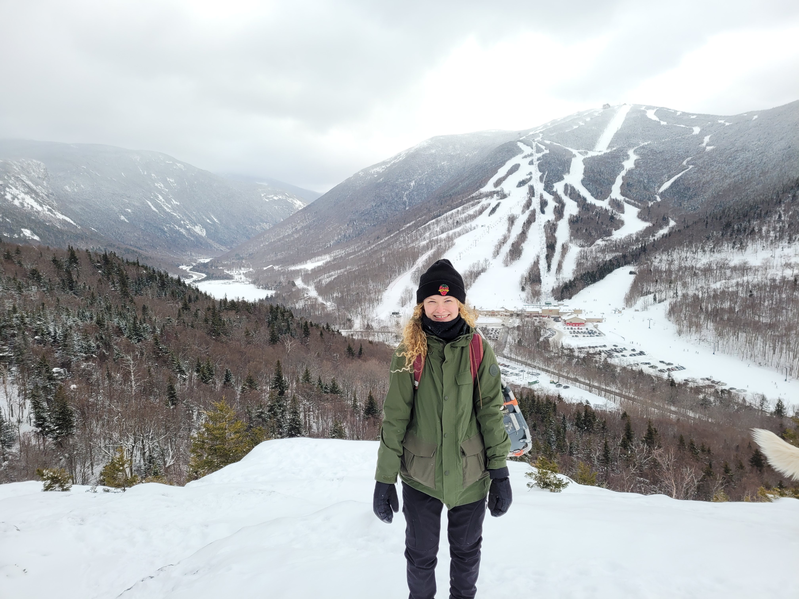

# Sophie Kogut
### Burlington, VT * skogut@uvm.edu

## Research in the Frietze Lab

### miRNA expression in pre-B ALL 
###### Examining expression of miRNAs and other ncRNAs in precursor B cell Acute Lymphoblastic Leukemia

### ThermoFly 
###### Transcriptomic analysis of thermal acclimation in Drosophila melanogaster

### NicheNet analysis for Cambridge
###### Exploring ligand - receptor interactions between co-cultured CLL cells and stroma
[Gene Expression: CLL/stroma co-culture](http://galaxy.med.uvm.edu:3838/sophiakogut/)

### HSV1 genomic interactions
###### 4C-Seq data examining cis-interactions in HSV1 infected cells

## Research in the Li Lab

## Publications

